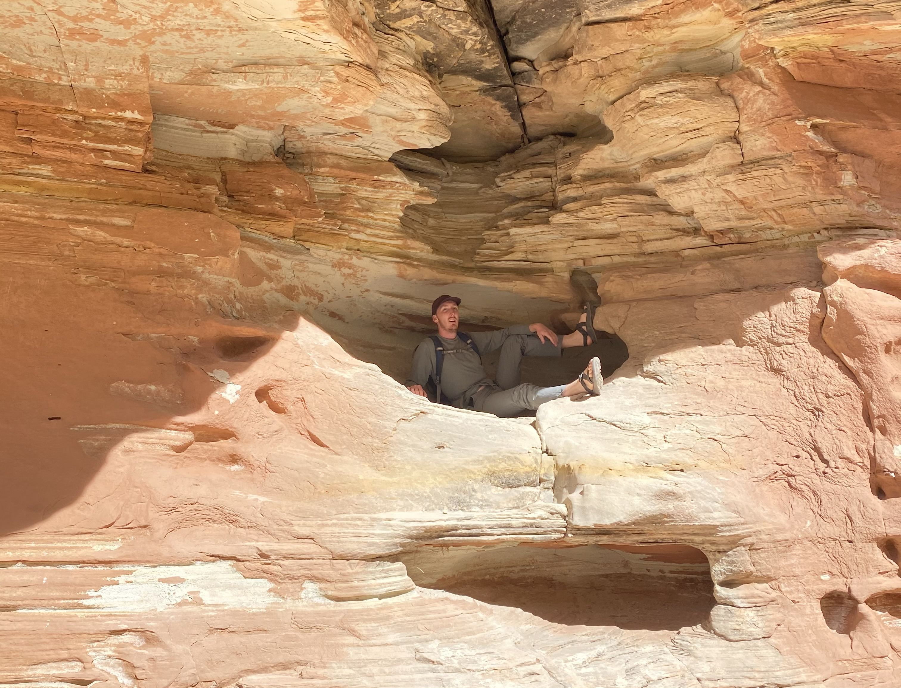

---

output:
  html_document:

pagetitle: About Me
---

## I am currently in my last semester at Utah Valley University in their Botany Program.  This fall I will be joining the Division of Biology at Kansas State University and will be studying drought tolerance in Andropogon gerardii. I enjoy studying plants as a whole, but I am particularly interested in grasslands and how fragmentations is affecting these important plant communities. 

## When I'm not shoving my nose into the reproductive organs of angiosperms, I enjoy hiking, climbing rocks, playing the piano, and hanging out with my crested gecko, fern.  The coolest they/them out there.  

