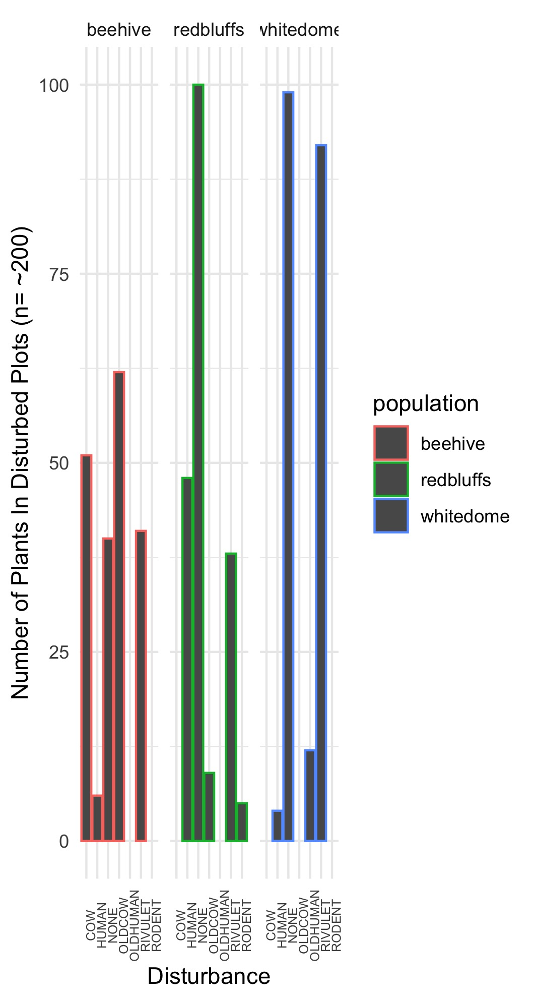

---

output:
  html_document:

pagetitle: Research and Experience 
---

## You can find a semi-up-to-date copy of my cv [Here](./cv_2020.pdf).
___

### Currently, I am studying the recruitment characteristics of Arctomecon humulis; an endangered species endemic to Washington County Utah.  The dwarf bear poppy grows on gypsum outcrops covered in cryptobiotic crusts.  I have collected data on roughly 200 seedlings from three populations hope that this study helps give insight into the establishment of this plant.  I'm still working on data analysis but below is a glimpse into the relationship between disturbance and the plants I'm studying.  

These three populations have and are experiencing very different disturbance regimes.  Beehive dome has a long history of cattle grazing that persists today.  The white dome nature preserve had a history of ORV disturbance until (insert year) and the study sites here have not been severely disturbed since.  The redbluffs population coexists with an extensive mountain biking network.  